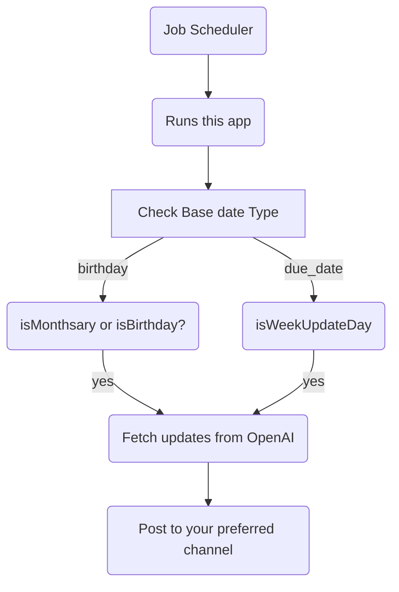

# GPT-BABY-DEVELOPMENT

This is a simple proof of concept that connects to OpenAI's API and fetches baby development milestones from it, so **IT GOES WITHOUT SAYING** that you should take it with a grain of salt. As each baby develops differently, baby development milestones are well, just milestones.

This was an idea that my wife threw in out of the blue and said as a joke "you should build it" and here we are. It's been quite fun developing it though :D

## Disclaimers

-   This is only a PoC. As any PoC, there are lots and lots of rough edges, so use it on your own discretion.
-   I'm not a doctor, and neither OpenAI's AI is. The messages you get from it should be somewhat accurate, but don't trust them blindly.

## How it works:

## Getting Started

-   Clone this repository locally;
-   Create a copy of `.env.sample` as your `.env` (`mv .env.sample .env`);
-   Fill in env variables;
-   Run the app with `yarn app`

### Supported ENV Variables:

-   `SELECTED_LANGUAGE_LOCALE`: `string`

    -   The language you will receive your updates in.
    -   Expected format $lang_$LOCALE, ie: pt_BR, en_US
    -   **Disclaimer**: We _"ask"_ chatGPT API to output content in this language and, on my testing it did it right 100% of the time, but your mileage may vary.

-   `BABY_NAME`: `string`;

    -   Stores your baby's name, duh.

-   `BABY_GENDER`: `enum('FEMALE', 'MALE', 'NEUTRAL')` -- defaults to neutral

    -   The gender that we send over to OpenAI to get the completions in.

-   `BABY_PRONOUNS`: `string`

    -   The preferred pronouns to refer to your baby. We don't do any validations here, for a bunch of reasons:
        -   I'm not the one to say which pronouns are the valid ones.
        -   Even I where, this would get complicated too fast, with different languages and all of that.

-   `BASE_DATE_TYPE`: `enum('DUE_DATE' | 'BIRTHDAY')`
    -   Tells the system what to consider `BASE_DATE` as.
    -   If set to `DUE_DATE`, we will push updates **every week**, on the weekday that your baby-to-be becomes one week older.
    -   If set to `BIRTHDAY`, we will push updates **once a month**, on their monthsary day.
-   `BASE_DATE`: `string(ish)`

    -   Holds the baby birthday following the format `YYYY-MM-DD`.
    -   PS: It _might_ work with other formats as well, but I have not tested it (nor I will.)

-   `PUBLISH_UPDATES_TO`: `enum('Telegram')`

    -   For now, the app just supports `Telegram` as the publishing media, but it's already wired to easily accept other channels to post updates to (eventually).

-   `TELEGRAM_BOT_API_KEY`: `string`;

    -   Your telegram bot API key. To Create a new bot, follow these steps:

        -   On Telegram, search for `@BotFather`, start a new chat and send it `/start`;
        -   Now, send it a new message with `/newbot`, then follow the prompts to setup its name and handle
        -   Your bot is now ready, and you will get the bot's `API key`

-   `TELEGRAM_GROUP_ID`:`string`

    -   Holds the Telegram Group ID to where the bot will send updates to. To find the actual group ID, follow these steps:
        -   Create a new Telegram group and add your newly(?) created bot to it.
        -   Send a new dummy message to the group, mentioning your bot, something like `/my_id @your_bot_name` should be enough.
        -   On your browser, open a new url with `https://api.telegram.org/bot<TELEGRAM_BOT_API_KEY>/getUpdates`
        -   You will then find your group id on the payload. The field you're looking for is named as `chat.id`.

-   `OPENAI_API_KEY`: `string`

    -   The API key we should use when interacting with OpenAI
    -   To create a new key, use the following link: https://platform.openai.com/account/api-keys

### Recommended setup

-   Once you've got the system configured and all of the environment variables defined as above, create a new entry on your favourite job scheduler to have it run this app on a daily basis:
-   ie: if using crontab, you'd add this line to get updates at 10am:

    -   `0 10 * * * cd path/to/this/repository  && yarn run app >/dev/null 2>&1`
